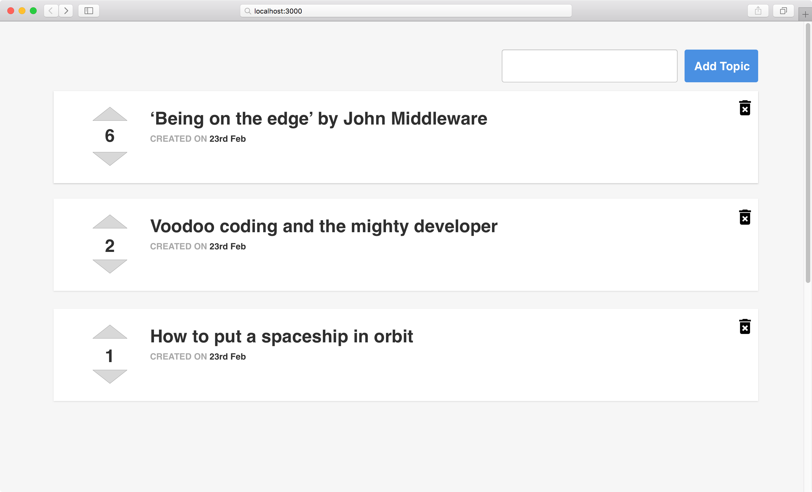

# Weekly assessment 5 (4 hours)

In this exercise you have to demonstrate your proficiency as a full-stack developer. You need to create a complete system that allows a user to list and post new topics, and let other users vote them up or down.

Read through this document before beginning with the assessment.

**You can search docs online, but not entire solutions.**

## Back End

Create a Koa back end in the  `./server` folder, following [this documentation](http://docs.codemocracy.apiary.io/).

We encourage you to use MongoDB with Mongoose for the data layer, but feel free to use your preferred database and ORM.

## Front End

Run `ng new codemocracy --directory client` to set up a new Angular app in the `./client` folder.  Use the Angular CLI for creating every component, service, pipe or anything else that you need.

Keep in mind that the API documentation provided in the back-end section offers a mock API, so you can use it to create the front-end before you start working with the server if you want.

Here you have an example of what the app should look like:

### Requirements:

- The home page should list all the topics. In particular:
  - The list should be sorted by score (descending).
  - Format the “created date”.
  - If there are no topics, the page should show a message like “No topics yet”.
- A new topic is created by clicking on the “Add Topic” button.
  - If the text field is empty an error should be shown.
  - Once the topic is stored on the server, it should be automatically added at the bottom of the list.
- Topics are deleted by clicking on the trash icon on the right.
- When the user clicks the up/down arrow, the topic’s score is updated and the list is sorted with the new scores.

## Extra credits

- Add a loader (spinner, etc.) for every API request.
- Make it responsive.
- Write unit tests for the back-end part.
